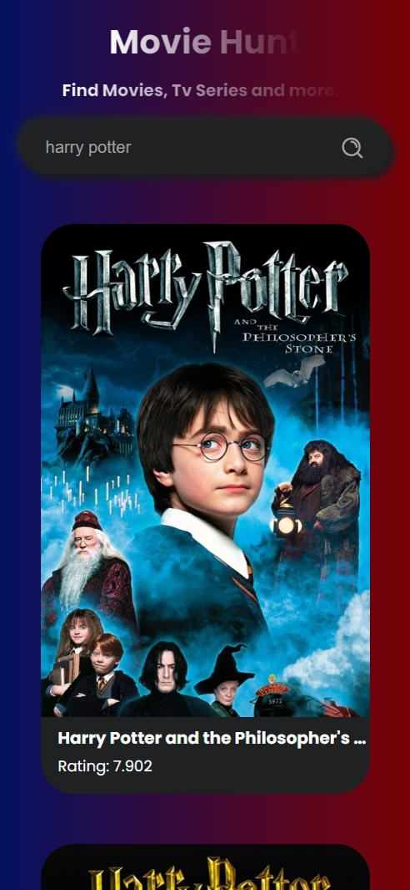

# 🎬 Movie Search App

A clean and responsive movie search web app built with **HTML, CSS, and JavaScript**. It fetches movie data from **The Movie Database (TMDb) API** and displays movie cards with posters, titles, ratings, and overviews.

This app supports both **desktop** and **mobile** views with a dark UI theme for modern aesthetics.

---

## 🔍 Features

- Search any movie by title  
- Fetches real-time movie data using TMDb API  
- Displays poster, title, rating, and overview  
- Responsive layout (Mobile + Desktop)
- Clean UI with hover effects

---

## 📷 Screenshots

### 💻 Desktop View


### 📱 Mobile View



## ⚙️ Tech Stack

- **HTML5**
- **CSS3**
- **Vanilla JavaScript**
- **TMDb API** (for fetching movie data)

---

## 🚀 How to Run Locally

1. Clone this repository  
   ```bash
   git clone https://github.com/YOUR_USERNAME/movie-search-app.git
Navigate into the project folder

cd movie-search-app
Open index.html in your browser

🌐 Live Demo
🔗 Live Site Here : [(https://movie-search-app-rho-eight.vercel.app/)]

📩 API Key Info
This app uses the TMDb API. Replace the placeholder API key in the JavaScript file with your own if cloning:

const API_KEY = "YOUR_API_KEY_HERE";
Get a free key at https://www.themoviedb.org

📚 Learnings
Used fetch() to call external APIs

Practiced DOM manipulation and dynamic HTML rendering

Gained experience in responsive web design

📄 License
This project is open-source and available under the MIT License.

🙌 Author
Sarwesh Sain
🧰 Web Developer
🌐 Portfolio | 📫 [(https://portfolio-website-nine-rouge-64.vercel.app/)]
