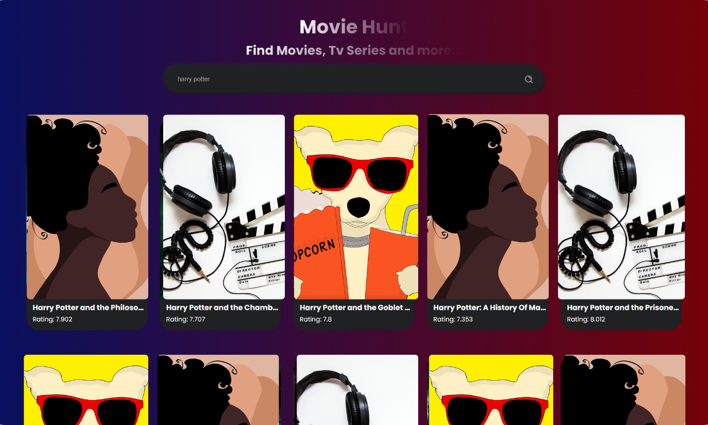

# 🎬 Movie Search App

A clean and responsive movie search web app built with **HTML, CSS, and JavaScript**. It fetches movie data from **The Movie Database (TMDb) API** and displays movie cards with posters, titles, ratings, and overviews.

This app supports both **desktop** and **mobile** views with a dark UI theme for modern aesthetics.

---

## 🔍 Features

- 🔎 Search any movie by title  
- 🎞️ Fetches real-time movie data using TMDb API  
- 🖼️ Displays poster, title, rating, and overview  
- 📱 Responsive layout (Mobile + Desktop)  
- 💅 Clean UI with hover effects  

---

## 📷 Screenshots

### 💻 Desktop View  


### 📱 Mobile View  


---

## ⚙️ Tech Stack

- 🧱 HTML5  
- 🎨 CSS3  
- ⚙️ Vanilla JavaScript  
- 🗂️ TMDb API  

---

## 🚀 How to Run Locally

1. **Clone this repository**
   ```bash
   git clone https://github.com/YOUR_USERNAME/movie-search-app.git
   ```

2. **Navigate into the project folder**
   ```bash
   cd movie-search-app
   ```

3. **Open `index.html` in your browser**  
   You can directly open the file or use a local server like Live Server in VS Code.

---

## 🔑 API Key Info

This app uses the TMDb API.  
To make it work on your local machine:

1. Go to [https://www.themoviedb.org](https://www.themoviedb.org) and create a free account.  
2. Get your API key from the account settings.  
3. Replace the placeholder in `script.js`:
   ```js
   const API_KEY = "YOUR_API_KEY_HERE";
   ```

---

## 🌐 Live Demo

🔗 [Live Site](https://movie-search-app-rho-eight.vercel.app/)

---

## 📚 Learnings

- Used `fetch()` to call external APIs  
- Practiced DOM manipulation and dynamic rendering  
- Gained experience in responsive design and modern UI  

---

## 📄 License

This project is open-source and available under the **MIT License**.

---

## 🙌 Author

**Sarwesh Sain**  
🧰 Web Developer  
🌐 [My Portfolio](https://portfolio-website-nine-rouge-64.vercel.app/)
